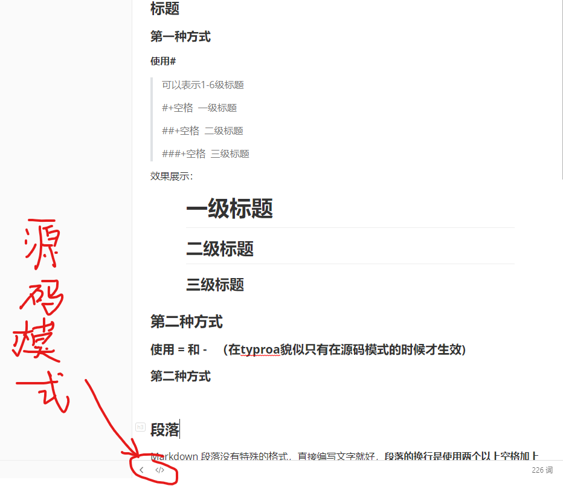
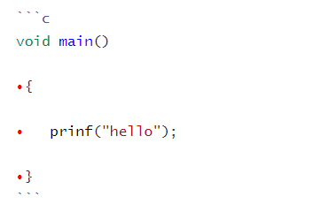

# Markdown语法总结

**主要包括：标题、段落、区块引用、代码区块、强调、列表、分割线、链接、图片、反斜杠、符号等。**

### 标题

#### 第一种方式  

**使用**#

> 可以表示1-6级标题
>
> #+空格  一级标题
>
> ##+空格  二级标题
>
> ###+空格  三级标题

效果展示：


#### 第二种方式 

使用 = 和 -   （在typroa貌似只有在源码模式的时候才生效)

**在这里开启**

`一级标题`
`===`
`二级标题`
`----`
*效果跟上面一样滴*

#### 第三种方式 (如果你是使用的typora)

一级标题    **ctrl+1**

二级标题    **ctrl +2**

### 段落格式

Markdown 段落没有特殊的格式，直接编写文字就好，**段落的换行是使用两个以上空格加上回车**  

**这里表示新的段落开始**

#### 字体

```markdown
*斜体文本*
_斜体文本_
**粗体文本**
__粗体文本__
***粗斜体文本***
___粗斜体文本___
```

#### 分割线

可以使用

三个以上的 * - _ 

来建立一个分割线

`---`

`***`

`___`

**效果如下**

***

---

#### 删除线

段前段后分别加上三个~号

正常文本

~~~
要删除的文本
~~~

#### 下划线

**用法**：


**效果如下**：

<u>下划线文本</u>

#### 脚注

**用法**：


**效果如下**：

在这里我们需要脚注[^T]

[^T]:需要注明的文本


### 列表

#### 无序列表

**用法**：使用 *或 +或 -  然后加上空格

**效果如下**：

* A
* B
* C

#### 有序列表

**用法**：

数字加上 .  

如需嵌套使用tab

**效果如下**：

1. 第一项
   1. 嵌套
   2. 嵌套
   3. 嵌套
2. 第二项
3. 第三项

### 区块

#### 区块引用

使用 > 符号

> 区块引用
>
> > 嵌套引用  

#### 代码区块

使用三个反引号+语言 



效果如下：

```c
void main()

​{

​	prinf("hello");

​}
```

### 链接

##### 普通用法：

`[链接名称]（链接地址）`

或

`<链接地址>`

这是[百度网址](www.baidu.com)

<www.baidu.com>

##### 高级用法：

`链接 [百度][a]`

`[a]:www.baidu.com'

链接[百度][a]

[a]:www.baidu.com

### 图片

**用法**

``

**效果**：


### 表格

**用法**：

```
|  表头   | 表头  |
|  ----  | ----  |
| 单元格  | 单元格 |
| 单元格  | 单元格 |
```

| 表头   | 表头   |
| ------ | ------ |
| 单元格 | 单元格 |
| 单元格 | 单元格 |